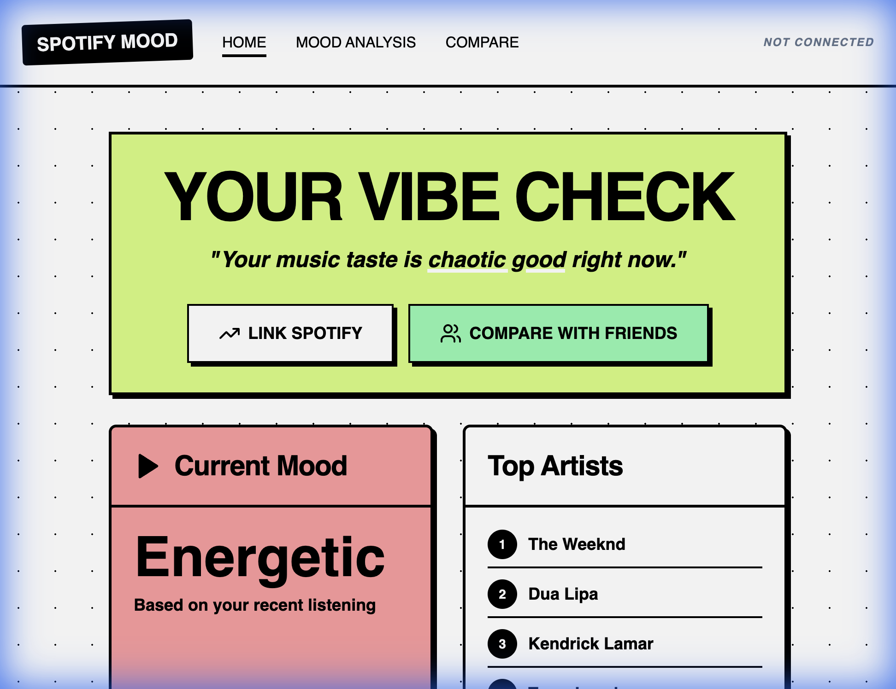
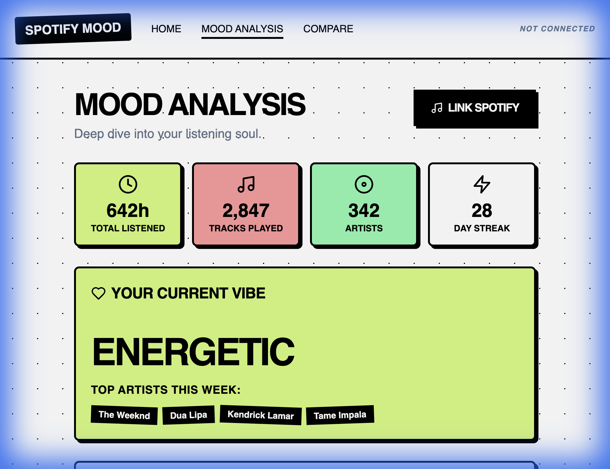

# audire (name tbd)

## what makes this special?

most music apps just tell you what you listened to. we tell you what it felt like. by linking your spotify account, we pull your data through a sophisticated pipeline that combines apis with deep metadata scraping and insights from curated kaggle datasets. we then allow you to compare these insights with friends at any point in time and then use machine learning models to analyze your listening patterns + provide personalized recommendations you and your friends.

### audio dna extraction
we don't just look at genres. our backend uses musicbrainz, web-scraped audio features, many (and many other) apis and acousticbrainz integration to perform a "dna extraction" on your tracks.

### deep song analysis
through custom web scraping and api enrichment, we retrieve high-level acoustic features that spotify's basic interface hides. we've integrated extensive kaggle music datasets to provide deeper context and benchmarks for your listening patterns. you'll see beautiful, neo-brutalist charts (radar, area, and bar charts) that visualize your "audio dna" in real-time.

### predictive ai and compare
we use a supervised machine learning algorithm—trained using web-scraped data and massive kaggle datasets—to predict what you'll be obsessed with next. by analyzing your historical energy shifts and mood transitions, the system identifies evolving patterns in your taste before you even realize they're changing. we're planning to integrate that predictive ai system into the compare feature - allowing you to see what your friends and you will prefer to listen to.

### the tech stack
- frontend: react (vite) + tailwind css + lucide icons (neo-brutalist design system)
- backend: python flask api handling oauth2 authentication
- database: sqlite for local, fast caching of your listening history
- analysis engine: utilises a machine learning model to analysis songs based on web-scraped data, kaggle datasets and a variety of apis *(still finalizing the analysis engine)

*not finished yet*
